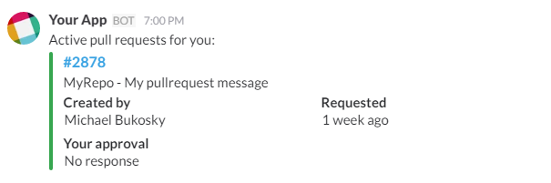
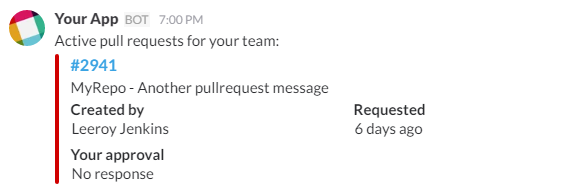

slack-bot-vsts-pullrequests
===============================

A Slack bot that gathers all the pull requests from all repositories in Visual Studio Team Services

## Usage

> View all pull requests for that you created or you are reviewing

`/pullrequests me`



> View all pull requests for that your team is reviewing

`/pullrequests team`



## Adding Slack Command to your Team
1. [Add Slash command to team](https://my.slack.com/services/new/slash-commands)
2. Add slack settings (see below)

| Key                                 	| Value                                                                	|
|-------------------------------------	|----------------------------------------------------------------------	|
| Command                             	| /pullrequests                                                        	|
| URL                                 	| https://something.com/pullrequest                                    	|
| Method                              	| POST                                                                 	|
| Autocomplete help text: Description 	| Show active pullrequest for you or your team                         	|
| Autocomplete help text: Usage hint  	| [me or team]                                                         	|

## Configuration

Update the `config.js` with your personal VSTS settings

```js
module.exports = {
  teamTokens: ['slack-team-token'],
  members: {
    mbukosky: 'mikebukosky'
  },
  vsts: {
    emailDomain: process.env.VSTS_EMAIL_DOMAIN || '@example.com',
    baseURL: process.env.VSTS_BASE_URL || 'https://example.visualstudio.com/defaultcollection/_apis',
    username: process.env.VSTS_USERNAME || 'mbukosky@example.com',
    password: process.env.VSTS_PASSWORD || 'TOKEN'
  }
};

```

## Build

`npm install`

## Run

`npm server.js`

## Test
`curl -X POST --data "token=<slack_token>&user_name=mbukosky" http://localhost:3000/pullrequest`
